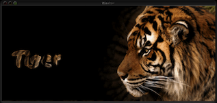
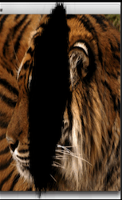
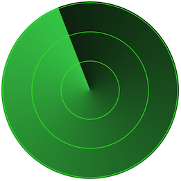

# QuartzDemo
QuartzDemo is an iOS application that collect almost all the sample code in Quartz 2D Programming Guide.

## Extension
I also implement some pretty cool effect mentioned in this guide that Apple doesn't provide source code. 

### Masking an image with an image mask

### Masking an image with color

### Masking an image by clipping the context

### Conical gradient

